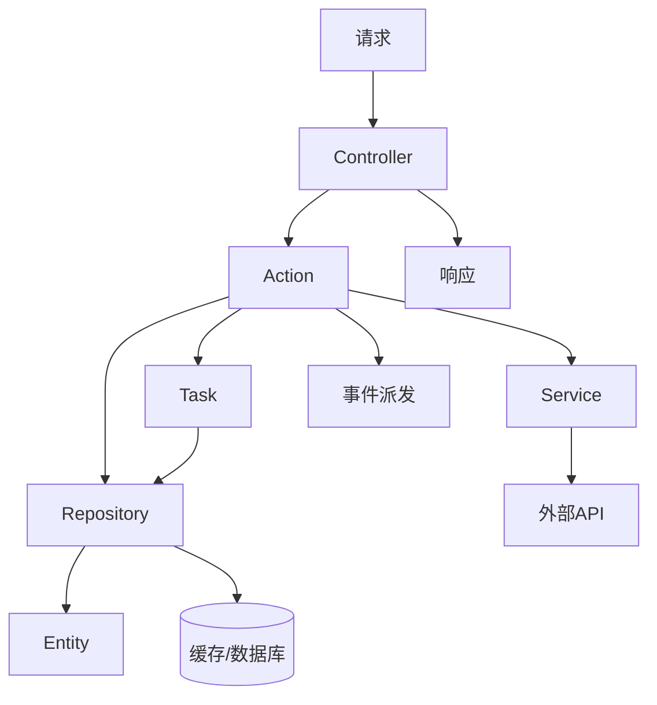
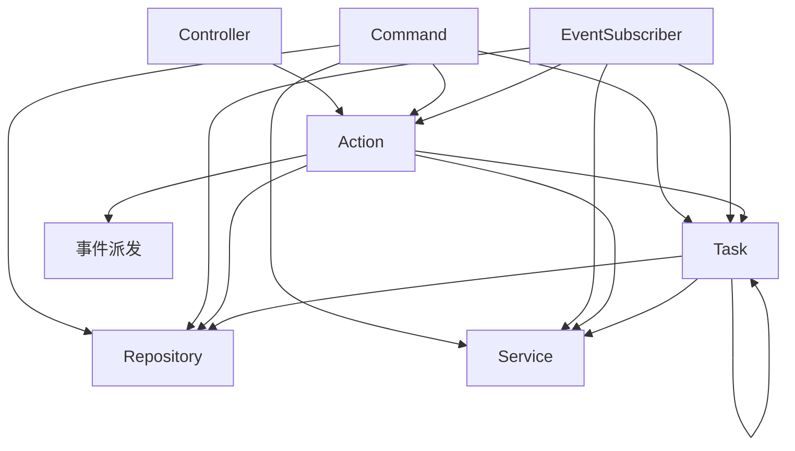

# AI 代码书写、审查规则 (Symfony/Porto架构)

## 📌 基本原则

1. **严格遵守 Porto 架构模式**，不越层调用
2. **保持 Symfony 最佳实践**，遵循 PSR 标准
3. **优先使用框架特性**，避免重复造轮子
4. **代码简洁高效**，避免过度设计
5. **不做无意义的封装**：方法必须比直接调底层多出逻辑，否则删掉用原方法

## 📁 项目目录结构

```
src/
├── Action/          # 业务逻辑编排层，调用 Task、Service、Repository、Event
├── Attribute/       # PHP 8 注解类（Attribute）
├── Cache/           # Redis 缓存封装（key 管理、TTL 策略）
├── Command/         # Symfony CLI 命令
├── Contract/        # 接口合约（Interface、Abstract），所有 Interface 必须放此目录
├── Controller/      # 控制器
│   ├── Admin/       # 管理后台接口
│   ├── Home/        # 前台页面接口
│   ├── Api/         # 开放 API 接口
│   └── Common/      # 公共/复用控制器
├── DataFixtures/    # 测试/开发用数据填充
├── Dto/
│   ├── Request/       # 请求 DTO（入参结构+验证），按模块分子目录
│   ├── Response/      # 响应 DTO（出参结构），按模块分子目录
│   ├── Event/         # 事件载荷 DTO，按模块分子目录
│   └── Transformer/   # DTO 基类 + RequestDtoResolver（请求参数自动解析注入）
├── Entity/          # Doctrine ORM 实体
├── Enum/            # 枚举类
├── Event/           # 事件类定义
├── EventSubscriber/ # 事件订阅器
├── Exceptions/      # 业务异常定义
├── Message/         # 消息体（DTO），通过 MessageBus 投递
├── MessageHandler/  # 消息处理器，#[AsMessageHandler] 自动注册
├── Repository/      # 数据仓库（连接器），封装数据库存取
├── Security/        # 防火墙、用户提供器
├── Service/         # 第三方服务封装（微信、支付宝、短信等），必须定义 Interface 在 Contract/
├── Task/            # 原子业务操作，可互调，可调 Service、Repository
└── Utils/           # 辅助工具函数
```

**请求主流程**：


**层间调用关系**：


**允许的调用**：
- Controller → Action
- Command → Action、Task、Service、Repository
- Action → Task、Service、Repository、EventDispatcher
- Task → Task、Repository、Service
- Repository → Entity、数据库/缓存
- Service → 外部 API
- EventSubscriber → Action、Task、Service、Repository

**禁止的调用**：
- Controller → Task、Service、Repository、EventDispatcher
- Service → Task、Repository、Action
- Task → Action
- Repository → Service、Action、Task

## 🔍 审查要点

### 1. 控制器 (Controller) 规则
- ✅ 只能调用 Action，不能直接调 Task、Repository、Service、EventDispatcher
- ✅ RequestDto 通过 RequestDtoResolver 自动注入 Controller 方法参数，无需手动转换
- ✅ 调用 Action 获取业务结果
- ✅ 用 ResponseDto 的 `response()` 方法输出 JSON Response
- ✅ 不能包含业务逻辑，不能 try-catch 异常

```php
// ✅ 正确示例 — RequestDto 自动注入，Action 返回 Entity，设值到 ResponseDto 后 response() 输出
#[Route('/api/users', methods: ['POST'])]
public function create(
    CreateUserRequestDto $dto,
    CreateUserAction     $action,
    UserResponseDto      $responseDto,
): Response {
    $user = $action->run($dto);
    $responseDto->id    = $user->id;
    $responseDto->email = $user->email;
    return $responseDto->response();
}

// ❌ 错误示例 - 直接调用 Repository
public function badExample(UserRepository $repository): Response
{
    $data = $repository->findAll(); // 禁止！
    return new JsonResponse($data);
}

// ❌ 错误示例 - Controller 里 try-catch
public function badExample2(CreateUserRequestDto $dto, CreateUserAction $action): Response
{
    try {
        return $action->run($dto); // 禁止 try-catch！异常由 kernel.exception 事件统一处理
    } catch (BusinessException $e) {
        // 永远不会到这里
    }
}
```

### 2. Action 规则
- ✅ 必须是单例服务，职责是**业务编排**，不直接操作数据
- ✅ `run()` 方法只接受 DTO 作为入参
- ✅ 必须处理所有预期异常
- ❌ Action 之间不能互调（Action 是业务编排顶层，不能嵌套调用）
- ✅ 可以调用多个 Task、Service、Repository、Event
- ✅ 可以调用 Repository 做数据读取，写操作直接使用 `EntityManagerInterface::persist()/flush()`
- ✅ 返回值类型可以是 Entity、array、string、bool、void 等，不做限制
- ❌ 不能直接返回 Response 对象（那是 Controller 的职责）

```php
// ✅ 正确示例
class CreateUserAction
{
    public function __construct(
        private CreateUserTask $task,
        private SendWelcomeEmailTask $emailTask,
        private WechatServiceInterface $wechatService
    ) {}

    public function run(CreateUserRequestDto $dto): UserEntity
    {
        try {
            $user = $this->task->run($dto);
            $this->emailTask->run($user);
            // 调用第三方服务发送微信通知
            $this->wechatService->sendRegisterNotify($user);
            return $user;
        } catch (UserExistsException $e) {
            throw new BusinessException('用户已存在');
        }
    }
}
```

### 3. Task 规则
- ✅ **单一原子操作**：一个 Task 只做一件事（创建用户、发送邮件、扣减库存）
- ✅ 不能接受 Request 对象
- ✅ 可以被 Action、Task、Command、EventSubscriber 调用
- ✅ **Task 之间可以互调**（如 `CreateUserTask` 调 `LogAuditTask`），禁止循环依赖
- ✅ 可以调用 Repository、Service
- ❌ 不能调用 Action（禁止向上调用）
- ✅ 不调 Repository 的纯计算也是 Task（如数据校验、格式转换、密码哈希）
- ✅ 必须有明确的返回值类型
- ✅ 多个 Task 组合复用场景，直接调多个 Task，不需要额外抽象

```php
// ✅ 正确示例 - Task 互调
class CreateUserTask
{
    public function __construct(
        private UserRepository $repository,
        private PasswordUtils $hasher,
        private LogAuditTask   $logAuditTask,
    ) {}

    public function run(CreateUserRequestDto $dto): UserEntity
    {
        $user = new UserEntity();
        $user->email    = $dto->email;
        $user->passwordHash = $this->hasher->hash($dto->password);

        $this->entityManager->persist($user);
        $this->entityManager->flush();

        // Task 调 Task 记录审计日志
        $this->logAuditTask->run('user.created', $user->id);

        return $user;
    }
}

// ✅ 正确示例 - Action 组合多个 Task
class CreateOrderAction
{
    public function __construct(
        private CreateOrderTask   $createOrderTask,
        private FindCouponTask    $findCouponTask,
        private ValidateCouponTask $validateCouponTask,
    ) {}

    public function run(CreateOrderRequestDto $dto): OrderEntity
    {
        if ($dto->couponId) {
            $coupon = $this->findCouponTask->run($dto->couponId);
            $this->validateCouponTask->run($coupon, $dto);
        }

        return $this->createOrderTask->run($dto);
    }
}
```

### 4. Event 与 EventSubscriber 规则
- ✅ 事件类放在 `src/Event/` 目录
- ✅ Subscriber 放在 `src/EventSubscriber/` 目录
- ✅ 用于跨模块解耦（如"用户注册后发积分"，积分模块不耦合用户模块）
- ✅ Subscriber 只能监听一个事件，单一职责
- ✅ 事件命名：`模块.动作` 格式，如 `user.registered`、`order.paid`
- ✅ Subscriber 内部可以调用 Action、Task、Service、Repository
- ✅ 事件 Payload 使用 `Dto/Event/{模块}/` 下的 DTO 传递，不用数组

```php
// ✅ 事件定义
class UserRegisteredEvent extends Event
{
    public function __construct(
        public readonly UserRegisteredDto $dto
    ) {}
}

// ✅ Subscriber 订阅
class SendRewardOnUserRegistered implements EventSubscriberInterface
{
    public function __construct(
        private GrantRewardAction $grantRewardAction,
    ) {}

    public static function getSubscribedEvents(): array
    {
        return [
            UserRegisteredEvent::class => 'onUserRegistered',
        ];
    }

    public function onUserRegistered(UserRegisteredEvent $event): void
    {
        $this->grantRewardAction->run($event->dto);
    }
}

// ✅ Action 中派发事件
class CreateUserAction
{
    public function __construct(
        private CreateUserTask          $task,
        private EventDispatcherInterface $dispatcher,
    ) {}

    public function run(CreateUserRequestDto $dto): UserEntity
    {
        $user = $this->task->run($dto);
        $this->dispatcher->dispatch(new UserRegisteredEvent(
            UserRegisteredDto::fromEntity($user)
        ));

        return $user;
    }
}
```

### 4.1 签名验证 (SignatureSubscriber)

`SignatureSubscriber` 订阅 `KernelEvents::REQUEST`（优先级 32），在 Controller 执行前校验接口签名，验证失败直接阻断。

**跳过规则**：
- `APP_ENV_CONFIG=local` 时跳过
- 路由在 `$directRouter` 白名单内跳过

**验证流程**：Header 提取 `Device-Type`(int) + `Timer`(秒级时间戳) → 校验设备类型 → 取密钥(`SIGN_{DEVICE}`) → 时效校验(`SIGN_EXPIRE`) → SHA256 签名比对

**客户端签名规则**：
```
Device={deviceType}&Nonce={nonce}&Secret={secret}&Timer={timer}
→ hash('sha256', ...) → Header: Sign
```

**请求头**：

| Header | 说明 |
|--------|------|
| `Device-Type` | 设备类型(int): 1=iOS, 2=Android, 3=Web, 4=小程序 |
| `Timer` | 秒级时间戳 |
| `Nonce` | 随机数 |
| `Sign` | SHA256 签名 |

**环境变量**（密钥放 `.env.local`）：

| 变量 | 说明 |
|------|------|
| `SIGN_EXPIRE` | 签名有效期(秒)，默认 60 |
| `SIGN_IOS` | iOS 密钥 |
| `SIGN_ANDROID` | Android 密钥 |
| `SIGN_WEB` | Web 密钥 |
| `SIGN_MINIPROGRAM` | 小程序密钥 |

### 5. Entity（实体）规则
- ✅ 定义数据结构和关系，属性 **private**，生成时不写 getter/setter（需要时自行添加）
- ❌ 不能包含业务逻辑
- ❌ 不能在 Entity 中直接操作数据库或调用 Repository
- ✅ 必须使用 Doctrine ORM 注解，type 必须用 `Types::*` 常量，禁止字符串字面量
- ✅ 时间戳统一用 Gedmo `#[Gedmo\Timestampable]`，不用 `#[ORM\HasLifecycleCallbacks]`
- ✅ 每张表必须写 `PostgreSQL` `COMMENT ON` 注释
- ✅ 同一表内主键、状态、类型等字段不重复表名前缀

**Entity 生成规则（强制执行）**：

##### 1. type 必须用 `Types::*` 常量，禁止字符串字面量

```php
use Doctrine\DBAL\Types\Types;

// ✅ 正确
#[ORM\Column(type: Types::INTEGER, options: ['comment' => '用户 ID'])]
#[ORM\Column(type: Types::STRING, length: 20)]
#[ORM\Column(type: Types::SMALLINT, options: ['default' => 1])]
#[ORM\Column(type: Types::DATETIME_MUTABLE, nullable: true)]
#[ORM\Column(type: Types::BIGINT)]

// ❌ 错误
#[ORM\Column(type: 'integer')]
```

##### CacheDto 额外规则
- ✅ `$ttl` 必须用乘法表达式，禁止直接写计算后的数字

```php
// ✅ 正确 — 一眼看出是 10 分钟 / 3 天
protected int $ttl = 60 * 10;            // 60秒 × 10分钟
protected int $ttl = 60 * 60 * 24 * 3;   // 60秒 × 60分 × 24时 × 3天

// ❌ 错误
protected int $ttl = 600;
protected int $ttl = 259200;
```

| PHP 类型 | Types 常量 |
|---------|-----------|
| int PK | `Types::INTEGER` |
| int | `Types::INTEGER` / `Types::SMALLINT` / `Types::BIGINT` |
| string | `Types::STRING` |
| datetime | `Types::DATETIME_MUTABLE` |
| date | `Types::DATE_MUTABLE` |

##### 2. 属性 private，生成时不写 getter/setter（需要时自行添加）
```php
// ✅ 属性 private，生成时不写 getter/setter
class UserEntity
{
    #[ORM\Column(type: 'string', length: 20)]
    private ?string $phone = null;

    #[ORM\Column(type: 'smallint', options: ['default' => 1, 'comment' => '用户状态：0=禁用 1=正常 2=封禁'])]
    private int $status = 1;
}
```

##### 3. 类型必须 import，禁止完全限定类名
```php
// ✅ 正确 — 顶部 import，属性直接用短名
use DateTimeInterface;

public ?DateTimeInterface $createdAt = null;

// ❌ 错误 — 禁止在属性上使用完全限定名
public ?\DateTimeInterface $createdAt = null;
```

##### 4. 时间戳用 Gedmo Timestampable
```php
use Gedmo\Mapping\Annotation as Gedmo;

#[ORM\Column(type: 'datetime', nullable: true, options: ['comment' => '创建时间'])]
#[Gedmo\Timestampable(on: 'create')]
private ?DateTimeInterface $createdAt = null;

#[ORM\Column(type: 'datetime', nullable: true, options: ['comment' => '更新时间'])]
#[Gedmo\Timestampable(on: 'update')]
private ?DateTimeInterface $updatedAt = null;
```

##### 5. 默认生成表索引（强制执行）

每张表 **必须** 在类注解上声明索引，不允许没有索引的表：

```php
// ✅ 正确 — 表级索引声明
#[ORM\Entity(repositoryClass: UserRepository::class)]
#[ORM\Table(name: 'users')]
#[ORM\Index(columns: ['parent_id'], name: 'idx_users_parent_id')]
#[ORM\Index(columns: ['status'], name: 'idx_users_status')]
class UserEntity
```

| 字段类型 | 索引策略 |
|---------|---------|
| 外键/关联字段（user_id, parent_id） | 必须建 `#[ORM\Index]` |
| 状态/类型枚举字段（status, type） | 必须建 `#[ORM\Index]` |
| 唯一约束字段（phone, openid） | `unique: true` 自动建唯一索引 |
| 高频查询字段（created_at） | 必须建 `#[ORM\Index]` |
| 联合查询字段 | 必须建复合 `#[ORM\Index]` |
| 联合唯一约束 | `#[ORM\UniqueConstraint]` |

##### 6. `#[ORM\Column]` 必须写 `options`、`comment`、`default`

**所有字段必须有默认值**：`int` 默认 `0`，`string` 默认 `''`，避免查询结果为 null。

```php
// ✅ int 字段 — 默认 0
#[ORM\Column(type: 'smallint', options: ['default' => 1, 'comment' => '用户状态：0=禁用 1=正常 2=封禁'])]
public int $status = 1;

// ✅ string 字段 — 默认 ''
#[ORM\Column(type: 'string', length: 100, options: ['default' => '', 'comment' => '昵称'])]
public string $nickname = '';

// ✅ 唯一约束且可为空的字段 — 保留 nullable
#[ORM\Column(type: 'string', length: 20, unique: true, nullable: true, options: ['comment' => '手机号，密码登录用'])]
public ?string $phone = null;
```

##### 7. 枚举字段注明全部可选值
```php
/** 登录方式：1=手机号密码 2=微信 openid */
#[ORM\Column(type: 'smallint', options: ['comment' => '登录方式：1=手机号密码 2=微信 openid'])]
public int $loginType;
```

##### 8. 关联字段注明关联目标
```php
/** 关联 users.id，一对一 */
#[ORM\Column(type: 'integer', unique: true, options: ['comment' => '关联 users.id，一对一'])]
public int $userId;
```

##### 9. 类级注释说明表用途和业务规则
```php
/**
 * 用户主表
 *
 * 登录方式：手机号+密码 / 微信 openid（通过 user_wechat JOIN）
 * 密码哈希 + 盐值存储，salt 每次随机生成
 */
#[ORM\Entity(repositoryClass: UserRepository::class)]
#[ORM\Table(name: 'users')]
class UserEntity
```

##### 10. 迁移同步生成 `COMMENT ON COLUMN`
```sql
COMMENT ON COLUMN users.status IS '用户状态：0=禁用 1=正常 2=封禁';
```

### 6. DTO 规则

**目录结构**：
```
Dto/
├── Request/
│   └── Common/
│       └── NoticeRequestDto.php
├── Response/
│   └── Common/
│       ├── ArrayResponseDto.php     # 纯数组输出
│       ├── TableResponseDto.php     # 分页列表输出
│       ├── SuccessResponseDto.php   # 空成功响应
│       └── BufferResponseDto.php    # 图片 buffer 输出
└── Transformer/
    ├── AbstractRequestDto.php       # Request DTO 基类
    ├── AbstractResponseDto.php      # Response DTO 基类
    └── RequestDtoResolver.php       # 参数自动解析器
```

**流转路径**：
```
请求参数 → RequestDtoResolver 自动注入到 Controller 方法参数 → Controller 直接拿到已校验的 RequestDto
  → Action → 返回值 → Controller → ResponseDto->response() → Response(JSON)
```

**核心接口**：
| 接口 | 位置 | 用途 |
|------|------|------|
| `RequestDtoInterface` | `Contract/` | Request DTO 标记，实现此接口的类可被 RequestDtoResolver 自动解析注入 |
| `ResponseDtoInterface` | `Contract/` | Response DTO 标记，继承 AbstractResponseDto 获得 response() 能力 |

- ✅ **RequestDto**：定义入参结构 + 验证规则，继承 `AbstractRequestDto`（implements `RequestDtoInterface`），`Dto/Request/{模块}/`
- ✅ **ResponseDto**：定义出参结构，继承 `AbstractResponseDto`（implements `ResponseDtoInterface`），`Dto/Response/{模块}/`
- 没有特殊需求不必覆写 `result()`，默认返回 `$this`，所有 public 属性自动序列化
- ✅ **EventDto**：事件载荷 DTO，`Dto/Event/{模块}/`
- ✅ **RequestDtoResolver**：通过 ReflectionClass 将请求参数直接填充到 DTO 属性（蛇形键名→驼峰键名），然后 Symfony Validator 校验，注入 Controller
- ✅ Action 只返回业务数据，格式化交给 ResponseDto 的 `result()` + `response()` 方法
- ✅ DTO 属性使用 public + 默认值，由 RequestDtoResolver 反射填充
- ✅ 必须声明严格类型

```php
// ✅ 请求 DTO — Dto/Request/Common/NoticeRequestDto.php
namespace App\Dto\Request\Common;

class NoticeRequestDto extends AbstractRequestDto
{
    #[Assert\NotBlank(message: '消息模板 ID 不能为空', groups: ['miniProgram'])]
    public string $tempId = '';

    #[Assert\NotBlank(message: '接收人 openID 不能为空', groups: ['miniProgram'])]
    public string $openId = '';
}
```

```php
// ✅ 响应 DTO — 覆写 result() 控制输出字段
namespace App\Dto\Response\Common;

class ArrayResponseDto extends AbstractResponseDto
{
    public function __construct(
        public array $data = []
    ) {}

    protected function result(): array
    {
        return $this->data;
    }
}
```

```php
// ✅ 分页响应 DTO — 属性直接作为 JSON 字段输出
namespace App\Dto\Response\Common;

class TableResponseDto extends AbstractResponseDto
{
    public int   $total     = 0;
    public int   $cursor    = 0;
    public bool  $hasMore   = false;
    public int   $pageCount = 0;
    public array $items     = [];
}
```

```php
// ✅ each() — 批量 Entity 转数组，常用于列表接口
class UserController
{
    #[Route('/users')]
    public function list(
        ListUsersAction  $action,
        ArrayResponseDto $response,
    ): Response {
        $users = $action->run();

        $response->data = $response->each($users, fn (UserEntity $u) => [
            'id'    => $u->id,
            'email' => $u->email,
        ]);

        return $response->response();
    }
}
```

```php
// ✅ Controller 中 RequestDto 自动注入，ResponseDto 注入后设值调用 response()
class TestController
{
    #[Route('/dto')]
    #[ValidatorGroup(['miniProgram'])]
    public function transformer(NoticeRequestDto $dto): Response
    {
        // $dto 已被 RequestDtoResolver 填充并校验，直接访问属性
        return new JsonResponse([
            'tempId' => $dto->tempId,
            'openId' => $dto->openId,
        ]);
    }

    #[Route('/array')]
    public function arr(ArrayResponseDto $response): Response
    {
        $response->data = [1, 2, 3];
        return $response->response(); // {"code":0,"message":"ok","result":[1,2,3]}
    }
}
```

```php
// ✅ Action 返回业务数据，不直接构造 Response
class GetUserAction
{
    public function __construct(
        private FindUserTask $findUserTask,
    ) {}

    public function run(GetUserRequestDto $dto): UserEntity
    {
        return $this->findUserTask->run($dto->id);
    }
}
```

### 7. Repository（连接器）规则
- ✅ 职责：封装数据查询逻辑，写操作统一使用 `EntityManagerInterface`
- ✅ 可以被 Action、Task、Command、EventSubscriber 调用，不能直接被 Controller 调用
- ✅ 只能返回 Entity 或 Entity 集合，不能返回 DTO 或数组
- ❌ 不能调用 Service、Action、Task（Repository 只连数据源）
- ✅ 只能访问 Entity、数据库/缓存
- ✅ 不能包含业务逻辑，只能做数据查询
- ❌ 不写 `save()`/`remove()`，写操作由 Task/Action 直接调 `EntityManagerInterface`
- ❌ 不写纯 `findOneBy`/`findBy` 的 wrapper（如 `findByUserId`），调用方直接调 Doctrine 原方法
- ✅ 复杂查询封装为自定义方法，不在外部拼 DQL/SQL
- ✅ 必须使用 Doctrine QueryBuilder，禁止拼接原生 SQL（复杂报表除外）

```php
// ✅ 正确示例
class UserRepository extends ServiceEntityRepository
{
    public function __construct(
        ManagerRegistry    $registry,
        private RedisUtils $redis,
    ) {
        parent::__construct($registry, UserEntity::class);
    }

    public function save(UserEntity $user): UserEntity
    {
        $this->getEntityManager()->persist($user);
        $this->getEntityManager()->flush();

        return $user;
    }

    public function findActiveByEmail(string $email): ?UserEntity
    {
        return $this->createQueryBuilder('u')
            ->where('u.email = :email')
            ->andWhere('u.status = :status')
            ->setParameter('email', $email)
            ->setParameter('status', UserStatus::STATUS_ACTIVE)
            ->getQuery()
            ->getOneOrNullResult();
    }

    /** @return UserEntity[] */
    public function findRecentlyActive(int $days = 7): array
    {
        return $this->createQueryBuilder('u')
            ->where('u.lastLoginAt >= :since')
            ->setParameter('since', new DateTime("-{$days} days"))
            ->orderBy('u.lastLoginAt', 'DESC')
            ->getQuery()
            ->getResult();
    }
}

// ❌ 错误示例 - Repository 中写业务逻辑
class UserRepository
{
    public function createVIPUser(array $data): UserEntity
    {
        // ❌ 不要在 Repository 里判断业务规则
        if ($data['balance'] > 10000) {
            $role = 'vip';
        }
        // ❌ 不要在 Repository 里调用外部服务
        $this->emailService->sendWelcome($data['email']);
    }
}

// ❌ 错误示例 - Task 中直接拼 DQL
class FindUserTask
{
    public function run(int $id): ?UserEntity
    {
        $dql = "SELECT u FROM App\Entity\UserEntity u WHERE u.id = :id";
        return $this->entityManager->createQuery($dql)
            ->setParameter('id', $id)
            ->getOneOrNullResult();
        // ❌ 应该在 Repository 中封装
    }
}
```

### 8. Service（第三方服务）规则
- ✅ 职责：封装第三方外部接口调用（微信、支付宝、短信、云服务等）
- ✅ **必须定义 Interface**，放在 `src/Contract/` 目录（如 `WechatServiceInterface`）
- ✅ 可以被 Action、Task、Command、EventSubscriber 调用
- ✅ 不能调用 Task、Repository、Action（Service 是叶子节点，只做外部通信）
- ✅ 必须处理外部接口的异常，统一转换为内部业务异常
- ✅ 必须记录外部接口调用日志（请求参数、响应内容、耗时）
- ✅ 外部 SDK 异常（如 `WechatClientException`）不属项目自定义异常，无需放在 `src/Exceptions/`
- ✅ 外部接口的请求/响应数据结构用专用 DTO 包装

```php
// ✅ 正确示例
class WechatService implements WechatServiceInterface
{
    public function __construct(
        private WechatClientInterface $client,
        private LoggerInterface       $logger,
        private RedisUtils            $redis,
    ) {}

    /**
     * 发送微信模板消息
     * @throws ServiceException 外部服务调用失败时抛出
     */
    public function sendTemplateMessage(string $openId, WechatTemplateDto $dto): void
    {
        try {
            $startTime = microtime(true);
            $result    = $this->client->post('/message/template/send', [
                'touser'      => $openId,
                'template_id' => $dto->templateId,
                'data'        => $dto->data,
            ]);
            $elapsed = (microtime(true) - $startTime) * 1000;

            $this->logger->info('微信模板消息发送成功', [
                'open_id'  => $openId,
                'elapsed'  => round($elapsed, 2) . 'ms',
                'response' => $result,
            ]);
        } catch (WechatClientException $e) { // WechatClientException 为微信 SDK 所抛，非项目自定义异常
            $this->logger->error('微信模板消息发送失败', [
                'open_id'    => $openId,
                'error'      => $e->getMessage(),
                'error_code' => $e->getCode(),
            ]);
            throw new ServiceException('微信服务暂不可用，请稍后重试');
        }
    }

    /**
     * 获取微信用户信息
     * @return WechatUserDto
     */
    public function getUserInfo(string $openId): WechatUserDto
    {
        // 先从 Redis 缓存读取
        $cache = $this->redis->getCache(WechatUserCacheDto::class, $openId);
        if ($cache !== null) {
            return WechatUserDto::fromArray($cache->data);
        }

        try {
            $data = $this->client->get('/user/info', ['openid' => $openId]);
            $dto = WechatUserDto::fromArray($data);

            // 写入缓存，TTL 由 WechatUserCacheDto 统一管理
            $cache = new WechatUserCacheDto($openId);
            $cache->data = $data;
            $this->redis->setCache($cache);

            return $dto;
        } catch (WechatClientException $e) {
            throw new ServiceException('获取微信用户信息失败');
        }
    }
}

// ❌ 错误示例 - Service 中写业务逻辑
class SmsService
{
    public function sendVerifyCode(string $phone): void
    {
        $code = random_int(100000, 999999);
        // ❌ Service 不应该调用 Task 或 Repository
        $this->smsCodeTask->save($phone, $code);
        // ❌ Service 不应该判断业务规则
        $user = $this->userRepository->findByPhone($phone);
        if ($user && $user->isBlacklisted()) {
            throw new BusinessException('该用户已被拉黑');
        }
        // ✅ Service 只做一件事：调用外部接口发送短信
        $this->client->send($phone, "您的验证码是：{$code}");
    }
}
```

### 9. Command（CLI 命令）规则
- ✅ 可以调用 Action、Task、Service、Repository
- ✅ 命令参数通过 `#[AsCommand]` 注解定义
- ✅ 必须输出有意义的信息（成功/失败/数量）
- ✅ 长时间运行的命令必须支持 `--limit` 和 `--offset` 分页
- ✅ 命令不处理 HTTP 异常，直接输出错误信息到 stderr

```php
// ✅ 正确示例
#[AsCommand(
    name: 'app:user:clear-expired',
    description: '清理过期未激活的用户',
)]
class CleanExpiredUserCommand extends Command
{
    public function __construct(
        private CleanExpiredUserAction $action,
    ) {
        parent::__construct();
    }

    protected function execute(InputInterface $input, OutputInterface $output): int
    {
        $result = $this->action->run();

        $output->writeln("清理完成：共删除 {$result->deletedCount} 个过期用户");

        return Command::SUCCESS;
    }
}

// ❌ 错误示例 - Command 包含业务逻辑
class BadCommand extends Command
{
    protected function execute(InputInterface $input, OutputInterface $output): int
    {
        // ❌ 不要在 Command 里写业务逻辑，应委托给 Action
        $user = new UserEntity();
        $user->email = $input->getArgument('email');
        $this->entityManager->persist($user);
        $this->entityManager->flush();
    }
}
```

### 10. 业务验证规则

- ✅ **简单验证**（非空、格式、长度）→ 写在 RequestDto 的 `#[Assert\*]` 注解里
- ✅ **复杂验证**（查库唯一性、业务规则）→ 写在 Action 或 Task 里，校验失败直接抛异常
- ✅ 验证失败抛 `ValidatorParamsException` 或 `BusinessException`
- ✅ 不在 Controller 里写验证逻辑
- ✅ 不在 Controller 里 try-catch 处理异常，由 Symfony `kernel.exception` 事件统一接管

```php
// ✅ RequestDto 负责简单验证
class CreateUserRequestDto
{
    public function __construct(
        #[Assert\NotBlank(message: '邮箱不能为空')]
        #[Assert\Email(message: '邮箱格式不正确')]
        public string $email,

        #[Assert\NotBlank]
        #[Assert\Length(min: 6, max: 32)]
        public string $password,
    ) {}
}

// ✅ Action 负责编排，数据查询走 Task
class CreateUserAction
{
    public function __construct(
        private CreateUserTask         $createUserTask,
        private CheckEmailUniqueTask   $checkEmailUniqueTask,
    ) {}

    public function run(CreateUserRequestDto $dto): UserEntity
    {
        // 复杂验证：通过 Task 检查邮箱是否重复
        $this->checkEmailUniqueTask->run($dto->email);

        return $this->createUserTask->run($dto);
    }
}

// ✅ Controller 不处理异常，干干净净
class UserController
{
    public function create(
        CreateUserRequestDto $dto,
        CreateUserAction     $action,
        UserResponseDto      $responseDto,
    ): Response {
        $user = $action->run($dto);
        $responseDto->id    = $user->id;
        $responseDto->email = $user->email;

        return $responseDto->response();
    }
}
```

### 11. Cache（缓存）规则

- ✅ 缓存 DTO 继承 `AbstractCacheDto`，实现 `CacheDtoInterface`
- ✅ `$cacheKey` 使用 `sprintf` 格式字符串，构造参数通过 `...$args` 传入父类构造函数
- ✅ `$ttl` 在 DTO 内统一管理，由 `RedisUtils` 通过反射读取
- ✅ 使用 `RedisUtils::getCache()` / `setCache()` / `delCache()` 读写缓存
- ✅ 序列化基于 `json_encode/decode` + 反射，不依赖 JMS Serializer

```php
class TestCacheDto extends AbstractCacheDto
{
    protected string $cacheKey = 'test:%s';
    protected int    $ttl      = 60 * 10;
    public string    $nickname = '';
    public int       $age      = 0;
}

// 读写
$redis->setCache(new TestCacheDto(1001));
$cache = $redis->getCache(TestCacheDto::class, 1001);
```

### 12. Messenger（消息队列）规则

- ✅ 消息体放在 `src/Message/`，处理器放在 `src/MessageHandler/`
- ✅ Handler 实现 `__invoke()` + `#[AsMessageHandler]` 自动注册
- ✅ 使用 `MessageBusInterface` 投递消息
- ✅ 多条消息类型可路由到同一 transport，一个消费者全处理

```php
// 投递
$bus->dispatch(new NoticeMessage('标题', '内容'));

// 消费
php bin/console messenger:consume rsync_queue --limit=100
```

**配置：**
```yaml
transports:
    rsync_queue:
        dsn: "%env(MESSENGER_TRANSPORT_DSN)%"
        options:
            stream: rsync_queue
        retry_strategy:
            max_retries: 3
            delay: 1000
            multiplier: 2
            max_delay: 5000

routing:
    App\Message\TestMessage:   rsync_queue
    App\Message\NoticeMessage: rsync_queue
```

## 🚀 性能优化规则

### 1. 数据库查询
- ✅ 使用索引查询，避免全表扫描
- ✅ 合理使用缓存（Redis）
- ✅ 批量操作使用事务
- ✅ 避免 N+1 查询问题

```php
// ✅ 正确 - 使用 JOIN 避免 N+1
$query = $this->createQueryBuilder('u')
    ->leftJoin('u.posts', 'p')
    ->addSelect('p')
    ->getQuery();

// ❌ 错误 - N+1 查询
foreach ($users as $user) {
    $posts = $user->getPosts(); // 每次循环都查询数据库
}
```

### 2. 内存优化
- ✅ 使用生成器处理大量数据
- ✅ 及时释放大对象引用
- ✅ 使用 unset() 清理不再使用的变量

```php
// ✅ 使用生成器
function readLargeFile(string $path): Generator
{
    $handle = fopen($path, 'r');
    while (($line = fgets($handle)) !== false) {
        yield $line;
    }
    fclose($handle);
}
```

### 3. 缓存策略
- ✅ 合理设置缓存过期时间
- ✅ 使用标签缓存便于清理
- ✅ 热点数据预加载

```php
// ✅ 缓存示例
class UserRepository
{
    public function findActiveUsers(): array
    {
        $cache = $this->redis->getCache(ActiveUsersCacheDto::class);
        if ($cache !== null) {
            return $cache->users;
        }

        $users = $this->createQueryBuilder('u')
            ->where('u.isActive = :active')
            ->setParameter('active', true)
            ->getQuery()
            ->getResult();

        $cache = new ActiveUsersCacheDto();
        $cache->users = $users;
        $this->redis->setCache($cache); // TTL 由 ActiveUsersCacheDto 管理

        return $users;
    }
}
```

## 📝 代码质量规则

### 1. 类型安全
- ✅ 所有方法必须声明返回类型
- ✅ 使用严格类型模式（declare(strict_types=1)）
- ✅ 参数必须声明类型
- ✅ 使用 PHPStan/Psalm 进行静态分析

### 2. 异常层级与处理

**异常继承链**：
```
RuntimeException (PHP 基类)
└── AbstractLogicException (业务异常基类)
    ├── BusinessException        — 通用业务异常（逻辑校验失败等）
    ├── NotFoundException        — 资源不存在（用户不存在、订单不存在等）
    ├── NoPermissionException    — 权限不足
    ├── ServiceException         — 第三方服务调用失败
    └── ValidatorParamsException — 参数验证失败
```

> 注意：继承 `RuntimeException` 而非 `LogicException`。
> `LogicException` 在 Symfony 中会被当作编程错误，触发 `request.CRITICAL` 日志，
> 导致 `ExceptionSubscriber` 处理前多出一条重复日志。

- ✅ 所有自定义异常必须放在 `src/Exceptions/` 目录
- ✅ 必须继承 `AbstractLogicException`（最终继承 `RuntimeException`）
- ✅ 异常信息必须明确可读
- ✅ 记录异常日志（不要暴露敏感信息）
- ✅ 使用 try-catch 处理预期异常
- ✅ 异常由 Symfony `kernel.exception` 事件统一处理，Controller 不 try-catch
- ❌ 禁止 `catch (Throwable)`，只能 `catch (Exception)`
- ✅ 所有 catch 必须记录 `$this->logger->error()`，不允许静默吞掉
- ✅ 以上 5 类为基类，允许按需派生子类（如 `UserExistsException extends BusinessException`），子类亦放在 `src/Exceptions/`

```php
// ✅ 异常类定义示例（通过属性默认值设定 code 和 message）
class NotFoundException extends AbstractLogicException
{
    public $code    = Response::HTTP_NOT_FOUND;
    public $message = '无资源';
}

class NoPermissionException extends AbstractLogicException
{
    public $code    = Response::HTTP_FORBIDDEN;
    public $message = '无权限';
}
```

```php
// ✅ Action 内部异常处理示例
class CreateUserAction
{
    public function __construct(
        private CreateUserTask           $createUserTask,
        private WechatServiceInterface   $wechatService,
        private LoggerInterface          $logger,
    ) {}

    public function run(CreateUserRequestDto $dto): UserEntity
    {
        try {
            $user = $this->createUserTask->run($dto);
            $this->wechatService->sendRegisterNotify($user);
            return $user;
        } catch (ValidatorParamsException|NotFoundException $e) {
            // 验证异常、资源不存在直接透传，由 kernel.exception 统一处理
            throw $e;
        } catch (ServiceException $e) {
            $this->logger->error('外部服务调用失败', ['exception' => $e]);
            throw new ServiceException('服务暂不可用，请稍后重试');
        } catch (Throwable $e) {
            $this->logger->error('创建用户失败', ['exception' => $e]);
            throw new BusinessException('系统繁忙，请稍后重试');
        }
    }
}
```

### 3. 数组格式化对齐规则（重点）
- ✅ 数组元素必须按照箭头符号 `=>` 对齐
- ✅ 注释必须在值后面，并与值保持至少一个空格
- ✅ 同组配置项之间用空行分隔
- ✅ 数组键名必须正确缩进

```php
// ✅ 正确示例 - 箭头对齐，注释统一
/** @var array 佣金配置比例 */
private array $configKeys = [
    'buyer_rebate_rate'          => 0,  // 下单用户返利(%)
    'buyer_consume_points_rate'  => 0,  // 下单用户消费积分(%)
    'buyer_sale_points_rate'     => 0,  // 下单用户销售积分(%)

    'level1_commission_rate'     => 0,  // 一级分销佣金(%)
    'level1_consume_points_rate' => 0,  // 一级分销消费积分(%)
    'level1_sale_points_rate'    => 0,  // 一级分销销售积分(%)

    'level2_commission_rate'     => 0,  // 二级分销津贴(%)
    'level2_consume_points_rate' => 0,  // 二级分销消费积分(%)
    'level2_sale_points_rate'    => 0,  // 二级分销销售积分(%)
];
```

# PHP 代码书写规范约定 (Symfony/Porto架构)

## 📝 命名约定

### 1. 类名命名 (大驼峰/PascalCase)
```php
// ✅ 正确
class UserController
class CreateUserAction
class UserRepository
class UserRequestDto
class ProductEntity

// ❌ 错误
class user_controller
class createUserAction
class Userrequestdto
```

### 2. 方法名命名 (小驼峰/camelCase)
```php
// ✅ 正确
public function getUserById(int $id): ?UserEntity
public function createUser(CreateUserRequestDto $dto): UserEntity
public function validateEmail(string $email): bool
protected function processData(array $data): array
private function initialize(): void

// ❌ 错误
public function GetUserById()
public function create_user()
public function ValidateEmail()
```

### 3. 属性/变量命名 (小驼峰)
```php
// ✅ 正确
private string $userName;
protected int $maxAttempts = 3;
public array $userList = [];
private ?DateTimeInterface $createdAt = null;

// ❌ 错误
private string $user_name;
protected int $MaxAttempts;
public array $UserList;
```

### 4. 常量命名 (全大写+下划线)
```php
// ✅ 正确
class UserStatus
{
    public const STATUS_ACTIVE = 'active';
    public const STATUS_INACTIVE = 'inactive';
    public const MAX_LOGIN_ATTEMPTS = 5;
    private const DEFAULT_ROLE = 'user';
}

// ❌ 错误
class UserStatus
{
    public const statusActive = 'active';
    public const Status_Inactive = 'inactive';
    public const maxLoginAttempts = 5;
}
```

## 🧱 代码结构规范

### 1. 大括号使用规范
```php
// ✅ 正确 - 类、方法、控制结构
class FindUserTask
{
    public function run(int $id): ?UserEntity
    {
        if ($id <= 0) {
            throw new InvalidArgumentException('ID必须大于0');
        }

        try {
            return $this->repository->find($id);
        } catch (Exception $e) {
            $this->logger->error($e->getMessage());
            return null;
        }
    }

    private function processUserData(UserEntity $user): array
    {
        return [
            'id'    => $user->id,
            'name'  => $user->name,
            'email' => $user->email,
        ];
    }
}
```

### 2. 构造函数与属性对齐规则（重点）
```php
// ✅ 正确示例 - 构造函数参数类型对齐
class CreateUserTask
{
    private UserRepository     $repository;
    private LoggerInterface    $logger;
    private RedisUtils         $redis;
    private ValidatorInterface $validator;

    public function __construct(
        UserRepository     $repository,
        LoggerInterface    $logger,
        RedisUtils         $redis,
        ValidatorInterface $validator
    ) {
        $this->repository = $repository;
        $this->logger     = $logger;
        $this->redis      = $redis;
        $this->validator  = $validator;
    }
}
```

### 3. 方法定义顺序

属性按类型名长度对齐（最长的排最前），方法按功能或字母序排列。

```php
class CreateUserTask
{
    // 1. 常量
    public const DEFAULT_LIMIT = 20;

    // 2. 属性（类型对齐）
    private UserRepository     $repository;
    private LoggerInterface    $logger;
    private RedisUtils         $redis;
    private ValidatorInterface $validator;

    // 3. 构造函数（参数类型对齐）
    public function __construct(
        UserRepository     $repository,
        LoggerInterface    $logger,
        RedisUtils         $redis,
        ValidatorInterface $validator
    ) {
        $this->repository = $repository;
        $this->logger     = $logger;
        $this->redis      = $redis;
        $this->validator  = $validator;
    }

    // 4. 公共方法 (按字母顺序或功能分组)
    public function batchUpdate(array $users, array $fields): void
    {
        // ...
    }

    public function create(CreateUserRequestDto $dto): UserEntity
    {
        // ...
    }

    public function find(int $id): ?UserEntity
    {
        // ...
    }

    public function remove(UserEntity $user): void
    {
        // ...
    }

    // 5. 受保护方法
    protected function validateUserData(array $data): bool
    {
        // ...
    }

    // 6. 私有方法
    private function logAction(string $action, array $context): void
    {
        // ...
    }
}
```

## 💬 注释规范

### 1. 文件头部注释
```php
<?php

declare(strict_types=1);

namespace App\Controller\Api\V1;

/**
 * 用户控制器
 * 负责处理用户相关的API请求
 */
class UserController
{
    // ...
}
```

### 2. 类注释
```php
/**
 * 用户业务逻辑处理类
 * 负责用户的创建、更新、删除等业务操作
 * @uses CreateUserTask 创建用户任务
 * @uses UpdateUserTask 更新用户任务
 * @uses UserRepository 用户数据仓库
 */
class UserAction
{
    // ...
}
```

### 3. 方法注释
```php
/**
 * 根据ID获取用户信息
 * 通过用户ID查询用户详细信息，包括基本信息、角色、权限等
 * @param int $id 用户ID，必须大于0
 * @param bool $includeRelations 是否包含关联数据
 * @return UserEntity|null 返回用户实体，未找到时返回null
 * @throws InvalidArgumentException 当ID无效时抛出
 * @throws DatabaseException 数据库查询异常
 * @example
 * $user = $action->getUserById(123, true);
 * @see UserRepository::find()
 * @see UserResponseDto
 */
public function getUserById(int $id, bool $includeRelations = false): ?UserEntity
{
    // ...
}
```

### 4. 属性注释
```php
/**
 * 用户数据仓库
 * @var UserRepository
 */
private UserRepository $repository;

/**
 * 最大登录尝试次数
 * 用户连续登录失败的最大次数，超过将锁定账户
 * @var int
 */
private int $maxLoginAttempts = 5;
```

## 📊 代码格式化规则

### 1. 缩进与空格
```php
// ✅ 正确
public function getUser(int $id): ?UserEntity
{
    if ($id <= 0) {
        return null;
    }

    return $this->repository->find($id);
}
```

### 2. 参数与数组格式化
```php
// ✅ 函数参数（多行时对齐）
public function createUser(
    string $username,
    string $email,
    string $password,
    array  $roles = ['ROLE_USER']
): UserEntity {
    // ...
}

// ✅ 数组格式化（箭头对齐）
$userData = [
    'id'       => 123,
    'name'     => '张三',
    'email'    => 'zhangsan@example.com',
    'roles'    => ['ROLE_USER', 'ROLE_EDITOR'],
    'settings' => [
        'theme'    => 'dark',
        'language' => 'zh-CN',
    ],
];
```

### 3. 类型声明
```php
// ✅ 完整类型声明
class UserRepository extends ServiceEntityRepository
{
    private LoggerInterface $logger;

    public function __construct(
        ManagerRegistry  $registry,
        LoggerInterface  $logger
    ) {
        parent::__construct($registry, UserEntity::class);
        $this->logger = $logger;
    }

    /** @return UserEntity[] */
    public function findActiveUsers(): array
    {
        return $this->findBy(['status' => 'active']);
    }

    public function getUserCount(): int
    {
        return $this->count([]);
    }
}
```

## ⚡ AI 强制执行规则

### 1. 代码审查必须检查
- ✅ 数组箭头对齐规则
- ✅ 构造函数参数类型对齐规则
- ✅ 属性赋值对齐规则
- ✅ 分层调用合规（详见下方调用矩阵）
- ✅ Action 可以调 Repository 做数据读取，写操作直接使用 `EntityManagerInterface::persist()/flush()`
- ✅ Service 必须有 Interface，放在 Contract 目录
- ✅ Task 之间可互调，禁止循环依赖
- ✅ Controller 只能调用 Action
- ✅ 事件通过 EventDispatcher 派发
- ✅ 类型声明完整性
- ✅ 异常层级正确（5 个基类继承 AbstractLogicException，允许派生子类）
- ✅ 第三方接口调用须经 Service 层封装
- ✅ 代码放在正确的目录

**调用矩阵**：

| 调用方 ↓ / 被调用方 → | Action | Task | Repository | Service | EventDispatcher |
|-----------------------|--------|------|------------|---------|-----------------|
| **Controller**        | ✅ | ❌ | ❌ | ❌ | ❌ |
| **Command**           | ✅ | ✅ | ✅ | ✅ | ❌ |
| **Action**            | ❌ | ✅ | ✅ | ✅ | ✅ |
| **Task**              | ❌ | ✅ | ✅ | ✅ | ❌ |
| **EventSubscriber**   | ✅ | ✅ | ✅ | ✅ | ❌ |
| **Service**           | ❌ | ❌ | ❌ | ❌ | ❌ |
| **Repository**        | ❌ | ❌ | ❌ | ❌ | ❌ |

> Service 只能调用外部 API；Repository 只能访问 Entity、数据库/缓存。

### 2. 自动修正建议
当发现以下问题时，AI 必须提供修正建议：
- ❌ 数组箭头未对齐
- ❌ 构造函数参数类型未对齐
- ❌ 属性赋值未对齐
- ❌ 跨层调用（Controller→Repository、Controller→Task、Service→Task、Task→Action）
- ❌ Action 或 Controller 直接调用第三方接口（未经过 Service 封装）
- ❌ Repository 包含业务逻辑
- ❌ 代码放错目录
- ❌ 异常未继承正确的基类
- ❌ 缺少类型声明
- ❌ 异常处理不完整

### 3. 优先级规则
1. **安全第一**：修复可能导致安全漏洞的代码
2. **性能优化**：修复可能导致性能问题的代码
3. **代码规范**：修复不符合规范的代码
4. **架构合规**：修复违反 Porto 架构的代码

## 🧪 测试规范

### 不测什么
- ❌ 只写集成测试，不写单元测试
- ❌ Entity 的 getter/setter — 纯数据结构，无逻辑不测
- ❌ DTO 的属性定义 — 结构声明不测
- ❌ 常量类 / 枚举类 — 纯值定义不测
- ❌ 配置文件的静态内容

### 测什么 — 集成测试优先

#### 1. Controller API 测试
- ✅ 测完整的 HTTP 请求 → 响应链路
- ✅ Service 层必须 mock（不真调微信/支付宝）
- ✅ 验证状态码、响应 JSON 结构、关键字段值

```php
class UserControllerTest extends WebTestCase
{
    public function testCreateUserSuccess(): void
    {
        $client = static::createClient();

        $client->request('POST', '/api/v1/users', [
            'json' => [
                'email'    => 'test@example.com',
                'password' => 'password123',
                'role'     => 'user',
            ],
        ]);

        $this->assertResponseStatusCodeSame(201);

        $body = json_decode($client->getResponse()->getContent(), true);
        $this->assertArrayHasKey('id', $body['data']);
        $this->assertSame('test@example.com', $body['data']['email']);
    }

    public function testCreateUserValidationError(): void
    {
        $client = static::createClient();

        $client->request('POST', '/api/v1/users', [
            'json' => ['email' => 'not-an-email'],
        ]);

        $this->assertResponseStatusCodeSame(422);
    }
}
```

#### 2. Action 集成测试
- ✅ 测完整业务链路 Action → Task → Repository
- ✅ 断言返回值类型和核心数据
- ✅ 测异常分支（重复用户、数据不存在等）
- ✅ 注入的 Service 全部 mock

```php
class CreateUserActionTest extends KernelTestCase
{
    private CreateUserAction       $action;
    private WechatService&\PHPUnit\Framework\MockObject\MockObject $wechatService;

    protected function setUp(): void
    {
        self::bootKernel();
        $container = static::getContainer();

        $this->wechatService = $this->createMock(WechatService::class);
        // Service 默认不抛异常（假设外部调用成功）
        $this->wechatService->method('sendRegisterNotify')->willReturn(null);

        // 替换容器中的 Service 为 mock
        $container->set(WechatService::class, $this->wechatService);

        $this->action = $container->get(CreateUserAction::class);
    }

    public function testRunCreatesUser(): void
    {
        $dto  = new CreateUserRequestDto('new@example.com', 'password123', 'user');
        $user = $this->action->run($dto);

        $this->assertInstanceOf(UserEntity::class, $user);
        $this->assertSame('new@example.com', $user->email);
    }

    public function testRunThrowsWhenEmailExists(): void
    {
        $dto = new CreateUserRequestDto('existing@example.com', 'password123', 'user');

        $this->expectException(BusinessException::class);
        $this->expectExceptionMessage('用户已存在');

        $this->action->run($dto);
    }
}
```

#### 3. Service Mock 规范
- ✅ Controller 测试和 Action 测试中，所有 Service 必须 mock
- ✅ Mock 粒度：mock 到 Service 的方法级别，不 mock 底层 HTTP 客户端
- ✅ 验证 Service 的调用次数和参数
- ✅ 模拟 Service 异常，验证内部异常转换逻辑

```php
// ✅ 验证 Service 被正确调用
public function testWechatServiceCalled(): void
{
    $this->wechatService
        ->expects($this->once())
        ->method('sendRegisterNotify')
        ->with($this->isInstanceOf(UserEntity::class));

    $this->action->run(new CreateUserRequestDto('test@test.com', 'pass123', 'user'));
}

// ✅ 模拟 Service 异常，验证转换为内部异常
public function testWechatServiceFailure(): void
{
    $this->wechatService
        ->method('sendRegisterNotify')
        ->willThrowException(new ServiceException('微信服务暂不可用'));

    $this->expectException(ServiceException::class);

    $this->action->run(new CreateUserRequestDto('test@test.com', 'pass123', 'user'));
}
```

#### 4. Repository 集成测试
- ✅ 测真实的数据库交互（用测试库，不用 mock）
- ✅ 测自定义查询方法
- ✅ 测 save/delete 操作
- ✅ 用事务回滚保持测试数据隔离

```php
class UserRepositoryTest extends KernelTestCase
{
    private UserRepository $repository;
    private EntityManagerInterface $em;

    protected function setUp(): void
    {
        self::bootKernel();
        $container    = static::getContainer();
        $this->repository = $container->get(UserRepository::class);
        $this->em         = $container->get(EntityManagerInterface::class);

        // 开启事务，tearDown 回滚
        $this->em->beginTransaction();
    }

    protected function tearDown(): void
    {
        $this->em->rollback();
        parent::tearDown();
    }

    public function testFindActiveByEmail(): void
    {
        $user = new UserEntity();
        $user->email = 'findme@example.com';
        $user->status = UserStatus::STATUS_ACTIVE;
        $this->entityManager->persist($user);
        $this->entityManager->flush();

        $found = $this->repository->findActiveByEmail('findme@example.com');

        $this->assertNotNull($found);
        $this->assertSame('findme@example.com', $found->email);
    }

    public function testFindActiveByEmailReturnsNullForInactive(): void
    {
        $user = new UserEntity();
        $user->email = 'inactive@example.com';
        $user->status = UserStatus::STATUS_INACTIVE;
        $this->entityManager->persist($user);
        $this->entityManager->flush();

        $found = $this->repository->findActiveByEmail('inactive@example.com');

        $this->assertNull($found);
    }
}
```

### 测试数据管理

- ✅ 每个测试自己创建所需数据（不依赖全局 fixture）
- ✅ Repository 测试用事务回滚，Controller/Action 测试用 `DAMADoctrineTestBundle` 自动回滚
- ✅ 不共享测试数据，每个测试用例独立

## 📋 最佳实践总结

1. **一致性**：整个项目保持统一的命名和格式
2. **可读性**：代码应该像文章一样易于阅读
3. **自文档化**：通过好的命名减少不必要的注释
4. **简洁性**：避免过度设计，保持简单
5. **可维护性**：考虑后续维护的便利性
6. **性能优先**：在保证可读性的前提下优化性能

**规范说明**：此规范基于 PSR-1、PSR-12 和 Symfony 编码标准，结合 Porto 架构模式制定。

**重要提示**：
1. 所有数组格式必须严格遵守箭头对齐规则
2. 所有构造函数参数必须类型对齐
3. 所有属性赋值必须对齐
4. 每次代码审查时，AI 必须使用此文件的最新规则进行审查
