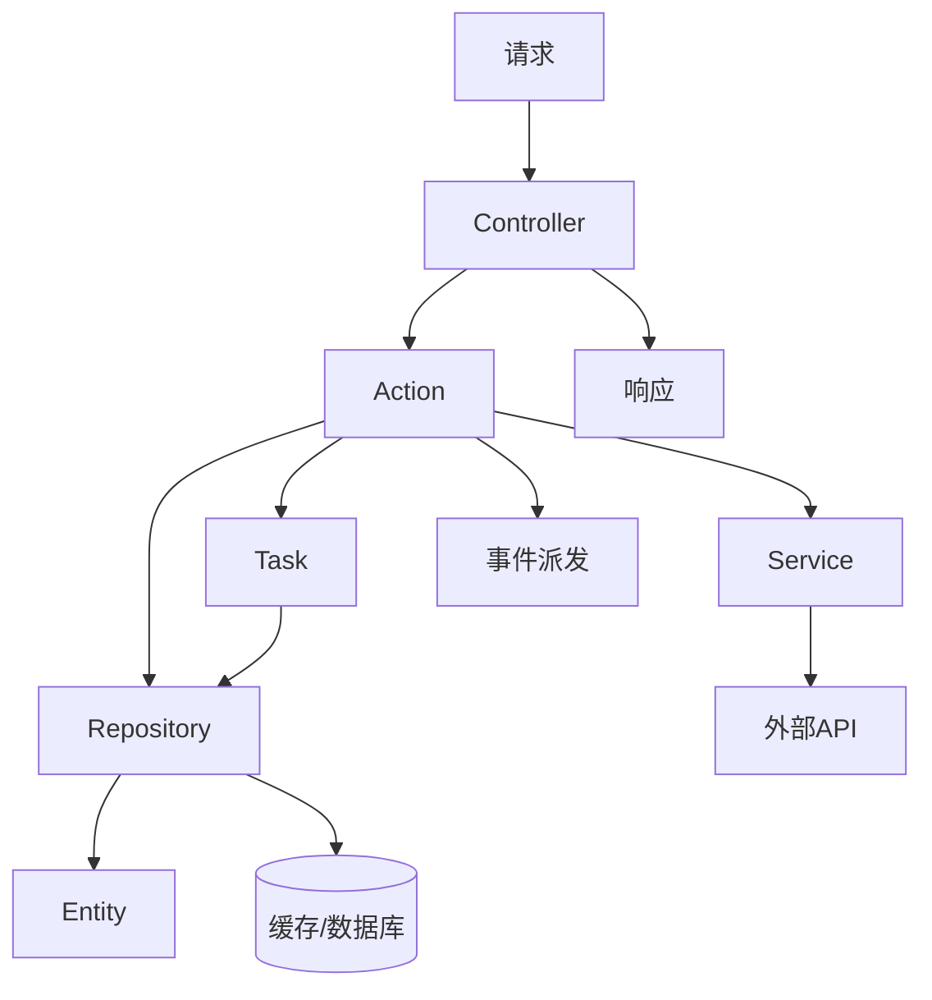
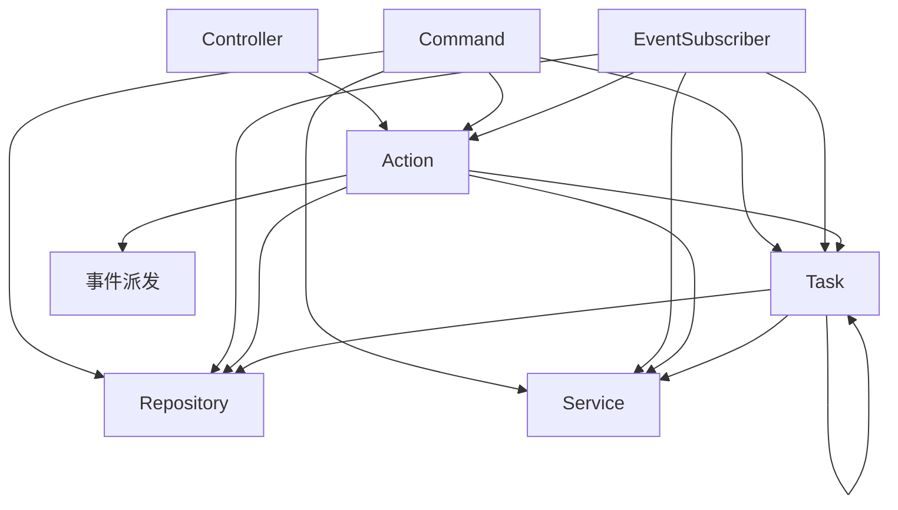

# Nice Symfony

### 常用命令
```shell
# composer
composer install
# 创建数据库
php bin/console doctrine:database:create
# 清理旧的数据库迁移（仅当这些迁移不再需要）
php bin/console doctrine:migrations:diff
# 清除数据库内的表
php bin/console doctrine:schema:drop --force --full-database
# 生成迁移文件
php bin/console make:migration
# 执行迁移
php bin/console doctrine:migrations:migrate
# 执行测试数据
php bin/console doctrine:fixtures:load
# 创建实体类
php bin/console make:entity
# 开启消息队列
php bin/console messenger:consume [name] -vv
# 清除 cache
php bin/console cache:clear
```

基于 Symfony 7.4 + Porto 架构模式的企业级 PHP 开发框架。

## 架构概览

> ##### 核心原则：
> ##### **不越层调用，每层只做一件事**。
> ##### **不做无意义封装**——方法必须比直接调底层多出逻辑，否则删掉。

### 请求主流程



### 层间调用关系



### 调用矩阵

| 调用方 ↓ / 被调用方 →      | Action | Task | Repository | Service | EventDispatcher |
|---------------------|--------|------|------------|---------|-----------------|
| **Controller**      | ✅      | ❌    | ❌          | ❌       | ❌               |
| **Command**         | ✅      | ✅    | ✅          | ✅       | ❌               |
| **Action**          | ❌      | ✅    | ✅          | ✅       | ✅               |
| **Task**            | ❌      | ✅    | ✅          | ✅       | ❌               |
| **EventSubscriber** | ✅      | ✅    | ✅          | ✅       | ❌               |
| **Service**         | ❌      | ❌    | ❌          | ❌       | ❌               |
| **Repository**      | ❌      | ❌    | ❌          | ❌       | ❌               |

> Service 只能调用外部 API；Repository 只能访问 Entity、数据库/缓存。

### 允许的调用

- Controller → Action
- Command → Action、Task、Service、Repository
- Action → Task、Service、Repository、EventDispatcher
- Task → Task、Repository、Service
- Repository → Entity、数据库/缓存
- Service → 外部 API
- EventSubscriber → Action、Task、Service、Repository

### 禁止的调用

- Controller → Task、Service、Repository、EventDispatcher（Controller 只能调 Action）
- Service → Task、Repository、Action（Service 是叶子节点，只做外部通信）
- Task → Action（禁止向上调用）
- Repository → Service、Action、Task（Repository 只连数据源）

---

## 目录结构

```
src/
├── Action/          # 业务逻辑编排层，调用 Task、Service、Repository、Event
├── Attribute/       # PHP 8 注解类（Attribute）
├── Cache/           # Redis 缓存封装（key 管理、TTL 策略）
├── Command/         # Symfony CLI 命令
├── Contract/        # 接口合约（Interface、Abstract），所有 Interface 必须放此目录
├── Controller/      # 控制器
│   ├── Admin/       # 管理后台接口
│   ├── Home/        # 前台页面接口
│   ├── Api/         # 开放 API 接口
│   └── Common/      # 公共/复用控制器
├── DataFixtures/    # 测试/开发用数据填充
├── Dto/
│   ├── Request/       # 请求 DTO（入参结构+验证），按模块分子目录
│   ├── Response/      # 响应 DTO（出参结构），按模块分子目录
│   ├── Event/         # 事件载荷 DTO，按模块分子目录
│   └── Transformer/   # DTO 基类 + RequestDtoResolver（请求参数自动解析注入）
├── Entity/          # Doctrine ORM 实体
├── Enum/            # 枚举类
├── Event/           # 事件类定义
├── EventSubscriber/ # 事件订阅器
├── Exceptions/      # 业务异常定义
├── Message/         # 消息体（DTO），通过 MessageBus 投递
├── MessageHandler/  # 消息处理器，#[AsMessageHandler] 自动注册
├── Repository/      # 数据仓库（连接器），封装数据库存取
├── Security/        # 防火墙、用户提供器
├── Service/         # 第三方服务封装（微信、支付宝、短信等），必须定义 Interface 在 Contract/
├── Task/            # 原子业务操作，可互调，可调 Service、Repository
└── Utils/           # 辅助工具函数
```

---

## 各层定义

### Controller（控制器）

请求入口，负责三件事：接收参数、调用 Action、构建响应。**不含任何业务逻辑**。

```php
#[Route('/api/users', methods: ['POST'])]
public function create(
    CreateUserRequestDto $dto,
    CreateUserAction     $action,
    UserResponseDto      $responseDto,
): Response {
    $user = $action->run($dto);
    $responseDto->id    = $user->id;
    $responseDto->email = $user->email;
    return $responseDto->response();
}
```

### Action（业务编排）

业务逻辑的编排者。只接受 DTO，返回业务数据（Entity、array、bool 等），**不返回 Response**。

- 可以调用多个 Task、Service、Repository、Event
- 可以调 Repository 做数据读取（写操作走 Task）
- 必须处理所有预期异常
- Action 之间不能互调

```php
class CreateUserAction
{
    public function __construct(
        private CreateUserTask          $task,
        private SendWelcomeEmailTask    $emailTask,
        private WechatServiceInterface  $wechatService,
    ) {}

    public function run(CreateUserRequestDto $dto): UserEntity
    {
        try {
            $user = $this->task->run($dto);
            $this->emailTask->run($user);
            $this->wechatService->sendRegisterNotify($user);
            return $user;
        } catch (UserExistsException $e) {
            throw new BusinessException('用户已存在');
        }
    }
}
```

### Task（原子操作）

单一原子业务操作。可以被 Action、Task、Command、EventSubscriber 调用。

- **Task 之间可以互调**（禁止循环依赖）
- 可以调用 Repository 和 Service
- 不能调用 Action（禁止向上调用）
- 不调 Repository 的纯计算也是 Task

```php
class CreateUserTask
{
    public function __construct(
        private UserRepository $repository,
        private PasswordUtils $hasher,
        private LogAuditTask   $logAuditTask,
    ) {}

    public function run(CreateUserRequestDto $dto): UserEntity
    {
        $user = new UserEntity();
        $user->email        = $dto->email;
        $user->passwordHash = $this->hasher->hash($dto->password);
        $this->entityManager->persist($user);
        $this->entityManager->flush();

        // Task 调 Task 记录审计日志
        $this->logAuditTask->run('user.created', $user->id);

        return $user;
    }
}
```

### Repository（连接器）

封装数据查询逻辑，只做读取。不写 `save()`/`remove()` 和纯 `findOneBy`/`findBy` wrapper。写操作统一使用 `EntityManagerInterface`。

- 可以被 Action、Task、Command、EventSubscriber 调用
- 不能直接被 Controller 调用
- 使用 Doctrine QueryBuilder，禁止原生 SQL（复杂报表除外）
- 不能包含业务逻辑

### Service（第三方服务）

封装外部接口调用（微信、支付宝、短信、云服务等）。

- **必须定义 Interface**，放在 `src/Contract/` 目录
- 可以被 Action、Task、Command、EventSubscriber 调用
- 不能调用 Task、Repository、Action（Service 是叶子节点，只做外部通信）
- 外部接口异常统一转为 `ServiceException`
- 必须记录调用日志（请求参数、响应、耗时）
- 禁止 `catch (Throwable)`，只能 `catch (Exception)`，所有 catch 必须 `logger->error()`

### Entity（实体）

数据库表结构的映射对象。属性 private，生成时不写 getter/setter（需要时自行添加）。不能写业务逻辑，不能直接操作数据库或调 Repository。

**生成规则（强制执行）**：

1. **type 必须用 `Types::*` 常量**，禁止字符串字面量
2. **属性 private，生成时不写 getter/setter**（需要时自行添加）
3. **类型必须 import，禁止完全限定类名**：`use DateTimeInterface;` 后直接用 `?DateTimeInterface`
4. **时间戳用 Gedmo `#[Gedmo\Timestampable(on: 'create'/'update')]`**
5. **默认生成表索引**：外键/关联字段、状态/类型枚举、高频查询字段必建 `#[ORM\Index]`，联合唯一用 `#[ORM\UniqueConstraint]`
6. **`#[ORM\Column]` 必须写 `options: ['comment' => '...']`**，说明字段含义和枚举值
7. **所有字段必须有默认值**：`int` 默认 `0`，`string` 默认 `''`，避免查询结果为 null
8. **枚举字段注明全部可选值**：如 `1=手机号密码 2=微信 openid`
9. **关联字段注明关联目标**：如 `关联 users.id，一对一`
10. **类级注释说明表用途和业务规则**
11. **迁移同步生成 `COMMENT ON COLUMN`**
12. **`$ttl` 必须用乘法表达式，秒×分×时×天顺序**：如 `60 * 10`（10分钟）、`60 * 60 * 24 * 3`（3天），禁止写 `600`、`259200`

```php
use DateTimeInterface;
use Doctrine\DBAL\Types\Types;
use Gedmo\Mapping\Annotation as Gedmo;

/**
 * 用户主表
 *
 * 登录方式：手机号+密码 / 微信 openid（通过 user_wechat JOIN）
 */
#[ORM\Entity(repositoryClass: UserRepository::class)]
#[ORM\Table(name: 'users')]
class UserEntity
{
    #[ORM\Id]
    #[ORM\GeneratedValue]
    #[ORM\Column(type: Types::INTEGER, options: ['comment' => '用户 ID，自增主键'])]
    private ?int $id = null;

    #[ORM\Column(type: Types::STRING, length: 20, nullable: true, unique: true, options: ['comment' => '手机号，密码登录用'])]
    private ?string $phone = null;

    #[ORM\Column(type: Types::SMALLINT, options: ['default' => 1, 'comment' => '用户状态：0=禁用 1=正常 2=封禁'])]
    private int $status = 1;

    #[ORM\Column(type: Types::DATETIME_MUTABLE, nullable: true, options: ['comment' => '创建时间'])]
    #[Gedmo\Timestampable(on: 'create')]
    private ?DateTimeInterface $createdAt = null;

    #[ORM\Column(type: Types::DATETIME_MUTABLE, nullable: true, options: ['comment' => '更新时间'])]
    #[Gedmo\Timestampable(on: 'update')]
    private ?DateTimeInterface $updatedAt = null;
}
```

### DTO（数据传输对象）

```
请求参数 → RequestDtoResolver 自动注入 Controller → 直接拿到已校验的 RequestDto → Action → 返回值 → ResponseDto->response() → Response(JSON)
```

- **RequestDto**：入参结构 + Assert 验证，继承 `AbstractRequestDto`，`Dto/Request/{模块}/`
- **ResponseDto**：出参结构，继承 `AbstractResponseDto`，无特殊需求不覆写 `result()`，`Dto/Response/{模块}/`
- **EventDto**：事件载荷 DTO，`Dto/Event/{模块}/`
- **RequestDtoResolver**：反射填充 DTO 属性（蛇形→驼峰键名转换），自动校验后注入 Controller

### Event & EventSubscriber

事件用于跨模块解耦。事件类放 `src/Event/`，订阅器放 `src/EventSubscriber/`。

- 事件 Payload 使用 `Dto/Event/{模块}/` 下的 DTO 传递，不用数组
- Subscriber 可以调用 Action、Task、Service、Repository
- Subscriber 单一职责，只监听一个事件
- 事件命名：`模块.动作` 格式，如 `user.registered`、`order.paid`

**完整示例：**

```php
// 1. 事件载荷 DTO — src/Dto/Event/Test/TestEventDto.php
readonly class TestEventDto
{
    public function __construct(
        public string $name,
        public int    $score,
    ) {}
}

// 2. 事件类 — src/Event/TestEvent.php
class TestEvent extends Event
{
    public function __construct(
        public readonly TestEventDto $dto,
    ) {}
}

// 3. 订阅器 — src/EventSubscriber/TestEventSubscriber.php
readonly class TestEventSubscriber implements EventSubscriberInterface
{
    public function __construct(
        private LoggerInterface $logger,
    ) {}

    public static function getSubscribedEvents(): array
    {
        return [TestEvent::class => 'onTestEvent'];
    }

    public function onTestEvent(TestEvent $event): void
    {
        $this->logger->info('测试事件已触发', [
            'name'  => $event->dto->name,
            'score' => $event->dto->score,
        ]);
    }
}

// 4. 在 Action 中派发（生产环境通过 Action，禁止 Controller 直接派发）
$dto = new TestEventDto('测试', 100);
$dispatcher->dispatch(new TestEvent($dto));
```

### Command（CLI 命令）

可以调用 Action、Task、Service、Repository。不能派发 EventDispatcher，长时间运行的命令必须支持 `--limit` 和 `--offset`。

### Messenger（消息队列）

基于 Redis 的异步消息队列，用于耗时操作解耦（邮件发送、数据同步、日志记录等）。

**目录结构：**
```
src/
├── Message/             # 消息体（DTO）
└── MessageHandler/      # 消息处理器
```

**.env 配置：**
```bash
MESSENGER_TRANSPORT_DSN="redis://secret_redis@redis?dbindex=1"
```

**配置（`config/packages/messenger.yaml`）：**
```yaml
framework:
    messenger:
        failure_transport: failed
        transports:
            failed: 'doctrine://default?queue_name=failed'

            rsync_queue:
                dsn: "%env(MESSENGER_TRANSPORT_DSN)%"
                options:
                    stream: rsync_queue
                retry_strategy:
                    max_retries: 3       # 最多重试 3 次
                    delay: 1000          # 首次重试延迟 1s
                    multiplier: 2        # 每次翻倍
                    max_delay: 5000      # 封顶 5s

        routing:
            App\Message\TestMessage:   rsync_queue
            App\Message\NoticeMessage: rsync_queue
```

**消息体：**
```php
readonly class NoticeMessage
{
    public function __construct(
        public string $title,
        public string $body,
    ) {}
}
```

**处理器：** 实现 `__invoke()` + `#[AsMessageHandler]` 自动注册。
```php
#[AsMessageHandler]
readonly class NoticeMessageHandler
{
    public function __invoke(NoticeMessage $message): void
    {
        // 处理消息逻辑
    }
}
```

**投递：**
```php
use Symfony\Component\Messenger\MessageBusInterface;

$bus->dispatch(new NoticeMessage('标题', '内容'));
```

**消费命令：**
```bash
# 启动消费者（持续监听）
php bin/console messenger:consume rsync_queue

# 限量消费
php bin/console messenger:consume rsync_queue --limit=100

# 限时消费（生产常驻）
php bin/console messenger:consume rsync_queue --time-limit=3600

# 查看所有可用 transport
php bin/console debug:messenger
```

---

## 异常层级

```
LogicException (Symfony 基类)
└── AbstractLogicException (业务异常基类)
    ├── BusinessException        — 通用业务异常（逻辑校验失败等）
    ├── NotFoundException        — 资源不存在（用户不存在、订单不存在等）
    ├── NoPermissionException    — 权限不足
    ├── ServiceException         — 第三方服务调用失败
    └── ValidatorParamsException — 参数验证失败
```

- 所有自定义异常放在 `src/Exceptions/`
- 简单验证（非空、格式）写在 RequestDto 的 `#[Assert]` 注解
- 复杂验证（查库、业务规则）在 Action 或 Task 中抛异常
- Controller 不 try-catch，由 `kernel.exception` 事件统一处理

---

## 测试规范

只写集成测试，不写单元测试。不测 Entity getter/setter、DTO 属性、常量类、配置文件。

- **Controller 测试**：完整 HTTP → 响应链路，Service mock
- **Action 测试**：完整 Action → Task → Repository 链路，Service mock
- **Repository 测试**：真数据库 + 事务回滚

---

## 编码规范

- 所有方法声明返回类型，文件头部 `declare(strict_types=1)`
- 数组箭头符号 `=>` 必须对齐，构造函数参数类型必须对齐，属性赋值必须对齐
- 类名大驼峰（PascalCase）、方法名小驼峰（camelCase）、属性名小驼峰、常量全大写+下划线

---

完整的 AI 代码审查规则见 [CLAUDE.md](./CLAUDE.md)。
